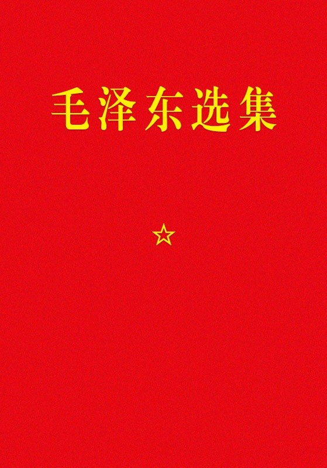
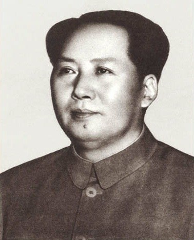

<h1 style="color:red;text-align:center;">全世界无产者，联合起来!</h1>

<h1 style="color:red;text-align:center;">毛泽东选集 第一卷</h1>

# 目录

* [第二版出版说明](#第二版出版说明)
* [本书出版的说明](#本书出版的说明)

<h1 id="第二版出版说明" style="color:red;text-align:center;">第二版出版说明</h1>

《毛泽东选集》第一至四卷，在五十年代初和六十年代初先后出版，距今已有三四十年。现在，根据中共中央的决定，对《毛泽东选集》第一至四卷进行修订，在中国共产党建立七十周年之际出版第二版。

《毛泽东选集》第一至四卷，是毛泽东同志亲自主持编辑的。第二版仍保持原有的篇目，只增加《反对本本主义》一篇。这篇著作， 曾一度散失，六十年代初才重新得到，后经毛泽东同志审定，在一九六四年出版的《毛泽东著作选读》中第一次公开发表。

这次修订，对有些文章误署的写作时间或发表时间，对正文中的某些史实以及少量错字、漏字等，作了校正。对某些用字，包括少数生僻难认的地名用字，根据文字规范化的要求，作了更改。对有些题解，作了少量史实和提法方面的修正；同时，新写了几篇题解。对正文所作的校订，分别列表附在各卷书末。

《毛泽东选集》第一至四卷的修订工作，主要是校订注释，改正注释中某些错讹的史实和不准确的提法，增补一些新的注释，删去少量的注释。注释校订工作是根据毛泽东同志的意见，从一九六二年起着手进行的，后因“文化大革命”而中断。这次校订，在六十年代工作的基础上，吸收了近二三十年来史料收集和学术研究的成果，对注释又作了进一步的修改和增补。

中共中央文献编辑委员会 
一九九一年二月

<h1 id="本书出版的说明" style="color:red;text-align:center;">本书出版的说明</h1>

这部选集，包括了毛泽东同志在中国革命各个时期中的重要著 作。几年前各地方曾经出过几种不同版本的《毛泽东选集》，都是没有经过著者审查的，体例颇为杂乱，文字亦有错讹，有些重要的著作又没有收进去。现在的这部选集，是按照中国共产党成立后所经历的各个历史时期并且按照著作年月次序而编辑的。这部选集尽可能地搜集了一些为各地方过去印行的集子还没有包括在内的重要著作。选集中的各篇著作，都经著者校阅过，其中有些地方著者曾作了一些文字上的修正，也有个别的文章曾作了一些内容上的补充和修改。

下面有几点属于出版事务的声明：

第一，现在出版的这个选集，还是不很完备的。由于国民党反动派对于革命文献的毁灭，由于在长期战争中革命文献的散失，我们现在还不能够找到毛泽东同志的全部著作，特别是毛泽东同志所写的许多书信和电报（这些在毛泽东同志著作中占很大的部分）。

第二，有些曾经流行的著作，例如《农村调查》，遵照著者的意见，没有编入；又如《经济问题与财政问题》，也遵照著者的意见， 只编进了其中的第一章（即《关于过去工作的基本总结》）。

第三，选集中作了一些注释。其中一部分是属于题解的，附在各篇第一页的下面；其他部分，有属于政治性质的，有属于技术性质 的，都附在文章的末尾。

第四，本选集有两种装订的本子。一种是各时期的著作合订的一卷本，另一种是四卷本。四卷本的第一卷包括第一次国内革命战争时期和第二次国内革命战争时期的著作；第二卷和第三卷包括抗日战争时期的著作；第四卷包括第三次国内革命战争时期的著作。

中共中央毛泽东选集出版委员会 
一九五一年八月二十五日

<h1 id="第一次国内革命战争时期" style="color:red;text-align:center;">第一次国内革命战争时期</h1>

<h2 id="中国社会各阶级的分析" style="color:red;text-align:center;">中国社会各阶级的分析</h2>

（一九二五年十二月一日）

谁是我们的敌人？谁是我们的朋友？这个问题是革命的首要问 题。中国过去一切革命斗争成效甚少，其基本原因就是因为不能团结真正的朋友，以攻击真正的敌人。革命党是群众的向导，在革命中未有革命党领错了路而革命不失败的。我们的革命要有不领错路和一定成功的把握，不可不注意团结我们的真正的朋友，以攻击我们的真正的敌人。我们要分辨真正的敌友，不可不将中国社会各阶级的经济地位及其对于革命的态度，作一个大概的分析。

中国社会各阶级的情况是怎样的呢？

地主阶级和买办阶级。在经济落后的半殖民地的中国，地主阶级和买办阶级完全是国际资产阶级的附庸，其生存和发展，是附属于帝国主义的。这些阶级代表中国最落后的和最反动的生产关系，阻碍中国生产力的发展。他们和中国革命的目的完全不相容。特别是大地主阶级和大买办阶级，他们始终站在帝国主义一边，是极端的反革命 派。其政治代表是国家主义派〔1〕和国民党右派。

中产阶级。这个阶级代表中国城乡资本主义的生产关系。中产阶级主要是指民族资产阶级，他们对于中国革命具有矛盾的态度：他们在受外资打击、军阀压迫感觉痛苦时，需要革命，赞成反帝国主义反军阀的革命运动；但是当着革命在国内有本国无产阶级的勇猛参加， 在国外有国际无产阶级的积极援助，对于其欲达到大资产阶级地位的阶级的发展感觉到威胁时，他们又怀疑革命。其政治主张为实现民族资产阶级一阶级统治的国家。有一个自称为戴季陶〔2〕“真实信徒”的， 在北京《晨报》〔3〕上发表议论说：“举起你的左手打倒帝国主义，举起你的右手打倒共产党。”这两句话，画出了这个阶级的矛盾惶遽状态。他们反对以阶级斗争学说解释国民党的民生主义，他们反对国民党联俄和容纳共产党〔4〕及左派分子。但是这个阶级的企图——实现民族资产阶级统治的国家，是完全行不通的，因为现在世界上的局面， 是革命和反革命两大势力作最后斗争的局面。这两大势力竖起了两面大旗：一面是红色的革命的大旗，第三国际〔5〕高举着，号召全世界一切被压迫阶级集合于其旗帜之下；一面是白色的反革命的大旗，国际联盟〔6〕高举着，号召全世界一切反革命分子集合于其旗帜之下。那些中间阶级，必定很快地分化，或者向左跑入革命派，或者向右跑入反革命派，没有他们“独立”的余地。所以，中国的中产阶级，以其本阶级为主体的“独立”革命思想，仅仅是一个幻想。

小资产阶级。如自耕农〔7〕，手工业主，小知识阶层——学生界、
中小学教员、小员司、小事务员、小律师，小商人等都属于这一类。这一个阶级，在人数上，在阶级性上，都值得大大注意。自耕农和手工业主所经营的，都是小生产的经济。这个小资产阶级内的各阶层虽然同处在小资产阶级经济地位，但有三个不同的部分。第一部分是有余钱剩米的，即用其体力或脑力劳动所得，除自给外，每年有余剩。这种人发财观念极重，对赵公元帅〔8〕礼拜最勤，虽不妄想发大财，却总想爬上中产阶级地位。他们看见那些受人尊敬的小财东，往往垂着一尺长的涎水。这种人胆子小，他们怕官，也有点怕革命。因为他们的经济地位和中产阶级颇接近，故对于中产阶级的宣传颇相信，对于革命取怀疑的态度。这一部分人在小资产阶级中占少数，是小资产阶级的右翼。第二部分是在经济上大体上可以自给的。这一部分人比较第一部分人大不相同，他们也想发财，但是赵公元帅总不让他们发 财，而且因为近年以来帝国主义、军阀、封建地主、买办大资产阶级的压迫和剥削，他们感觉现在的世界已经不是从前的世界。他们觉得现在如果只使用和从前相等的劳动，就会不能维持生活。必须增加劳动时间，每天起早散晚，对于职业加倍注意，方能维持生活。他们有点骂人了，骂洋人叫“洋鬼子”，骂军阀叫“抢钱司令”，骂土豪劣绅 叫“为富不仁”。对于反帝国主义反军阀的运动，仅怀疑其未必成功（理由是：洋人和军阀的来头那么大），不肯贸然参加，取了中立的态度，但是绝不反对革命。这一部分人数甚多，大概占小资产阶级的一半。第三部分是生活下降的。这一部分人好些大概原先是所谓殷实人家，渐渐变得仅仅可以保住，渐渐变得生活下降了。他们每逢年终结账一次，就吃惊一次，说：“咳，又亏了！”这种人因为他们过去过着好日子，后来逐年下降，负债渐多，渐次过着凄凉的日子，“瞻念前途，不寒而栗”。这种人在精神上感觉的痛苦很大，因为他们有一个从前和现在相反的比较。这种人在革命运动中颇要紧，是一个数量不小的群众，是小资产阶级的左翼。以上所说小资产阶级的三部分， 对于革命的态度，在平时各不相同；但到战时，即到革命潮流高涨、可以看得见胜利的曙光时，不但小资产阶级的左派参加革命，中派亦可参加革命，即右派分子受了无产阶级和小资产阶级左派的革命大潮所裹挟，也只得附和着革命。我们从一九二五年的五卅运动〔9〕和各地农民运动的经验看来，这个断定是不错的。

半无产阶级。此处所谓半无产阶级，包含：（一）绝大部分半自
耕农〔10〕，（二）贫农，（三）小手工业者，（四）店员〔11〕，（五） 小贩等五种。绝大部分半自耕农和贫农是农村中一个数量极大的群 众。所谓农民问题，主要就是他们的问题。半自耕农、贫农和小手工业者所经营的，都是更细小的小生产的经济。绝大部分半自耕农和贫农虽同属半无产阶级，但其经济状况仍有上、中、下三个细别。半自耕农，其生活苦于自耕农，因其食粮每年大约有一半不够，须租别人田地，或者出卖一部分劳动力，或经营小商，以资弥补。春夏之间， 青黄不接，高利向别人借债，重价向别人籴粮，较之自耕农的无求于人，自然景遇要苦，但是优于贫农。因为贫农无土地，每年耕种只得收获之一半或不足一半；半自耕农则租于别人的部分虽只收获一半或不足一半，然自有的部分却可全得。故半自耕农的革命性优于自耕农而不及贫农。贫农是农村中的佃农，受地主的剥削。其经济地位又分两部分。一部分贫农有比较充足的农具和相当数量的资金。此种农 民，每年劳动结果，自己可得一半。不足部分，可以种杂粮、捞鱼 虾、饲鸡豕，或出卖一部分劳动力，勉强维持生活，于艰难竭蹶之 中，存聊以卒岁之想。故其生活苦于半自耕农，然较另一部分贫农为优。其革命性，则优于半自耕农而不及另一部分贫农。所谓另一部分贫农，则既无充足的农具，又无资金，肥料不足，土地歉收，送租之外，所得无几，更需要出卖一部分劳动力。荒时暴月，向亲友乞哀告怜，借得几斗几升，敷衍三日五日，债务丛集，如牛负重。他们是农民中极艰苦者，极易接受革命的宣传。小手工业者所以称为半无产阶级，是因为他们虽然自有简单的生产手段，且系一种自由职业，但他们也常常被迫出卖一部分劳动力，其经济地位略与农村中的贫农相 当。因其家庭负担之重，工资和生活费用之不相称，时有贫困的压迫和失业的恐慌，和贫农亦大致相同。店员是商店的雇员，以微薄的薪资，供家庭的费用，物价年年增长，薪给往往须数年一增，偶与此辈倾谈，便见叫苦不迭。其地位和贫农及小手工业者不相上下，对于革命宣传极易接受。小贩不论肩挑叫卖，或街畔摊售，总之本小利微， 吃着不够。其地位和贫农不相上下，其需要一个变更现状的革命，也和贫农相同。

无产阶级。现代工业无产阶级约二百万人。中国因经济落后，故
现代工业无产阶级人数不多。二百万左右的产业工人中，主要为铁 路、矿山、海运、纺织、造船五种产业的工人，而其中很大一个数量是在外资产业的奴役下。工业无产阶级人数虽不多，却是中国新的生产力的代表者，是近代中国最进步的阶级，做了革命运动的领导力 量。我们看四年以来的罢工运动，如海员罢工〔12〕、铁路罢工〔13〕、开滦和焦作煤矿罢工〔14〕、沙面罢工〔15〕以及“五卅”后上海香港两处的大罢工〔16〕所表现的力量，就可知工业无产阶级在中国革命中所处地位的重要。他们所以能如此，第一个原因是集中。无论哪种人都不如他们的集中。第二个原因是经济地位低下。他们失了生产手段，剩下两手，绝了发财的望，又受着帝国主义、军阀、资产阶级的极残酷的待遇，所以他们特别能战斗。都市苦力工人的力量也很可注意。以码头搬运夫和人力车夫占多数，粪夫清道夫等亦属于这一类。他们除双手外，别无长物，其经济地位和产业工人相似，惟不及产业工人的集中和在生产上的重要。中国尚少新式的资本主义的农业。所谓农村无产阶级，是指长工、月工、零工等雇农而言。此等雇农不仅无土地，无农具，又无丝毫资金，只得营工度日。其劳动时间之长，工资之少， 待遇之薄，职业之不安定，超过其他工人。此种人在乡村中是最感困难者，在农民运动中和贫农处于同一紧要的地位。

此外，还有数量不小的游民无产者，为失了土地的农民和失了工作机会的手工业工人。他们是人类生活中最不安定者。他们在各地都有秘密组织，如闽粤的“三合会”，湘鄂黔蜀的“哥老会”，皖豫鲁等省的“大刀会”，直隶及东三省的“在理会”，上海等处的“青帮”〔17〕，都曾经是他们的政治和经济斗争的互助团体。处置这一批人，是中国的困难的问题之一。这一批人很能勇敢奋斗，但有破坏性，如引导得法， 可以变成一种革命力量。

综上所述，可知一切勾结帝国主义的军阀、官僚、买办阶级、大地主阶级以及附属于他们的一部分反动知识界，是我们的敌人。工业无产阶级是我们革命的领导力量。一切半无产阶级、小资产阶级，是我们最接近的朋友。那动摇不定的中产阶级，其右翼可能是我们的敌人，其左翼可能是我们的朋友——但我们要时常提防他们，不要让他们扰乱了我们的阵线。

注释

[^1]: 毛泽东此文是为反对当时党内存在着的两种倾向而写的。当时党内的第一种倾向，以陈独秀为代表，只注意同国民党合作，忘记了农民，这是右倾机会主义。第二种倾向，以张国焘为代表，只注意工人运动，同样忘记了农民，这是“左”倾机会主义。这两种机会主义都感觉自己力量不足，而不知道到何处去寻找力量，到何处去取得广大的同盟军。毛泽东指出中国无产阶级的最广大和最忠实的同盟军是农民，这样就解决了中国革命中的最主要的同盟军问题。毛泽东并且预见到当时的民族资产阶级是一个动摇的阶级，他们在革命高涨时将要分化，其右翼将要跑到帝国主义方面去。一九二七年所发生的事变，证明了这一点。

国家主义派指中国青年党，当时以其外围组织“中国国家主义青年团”的名义公开进行活动。组织这个政团的是一些反动政客，他们投靠帝国主义和当权的反动派，把反对中国共产党和苏联当作职业。